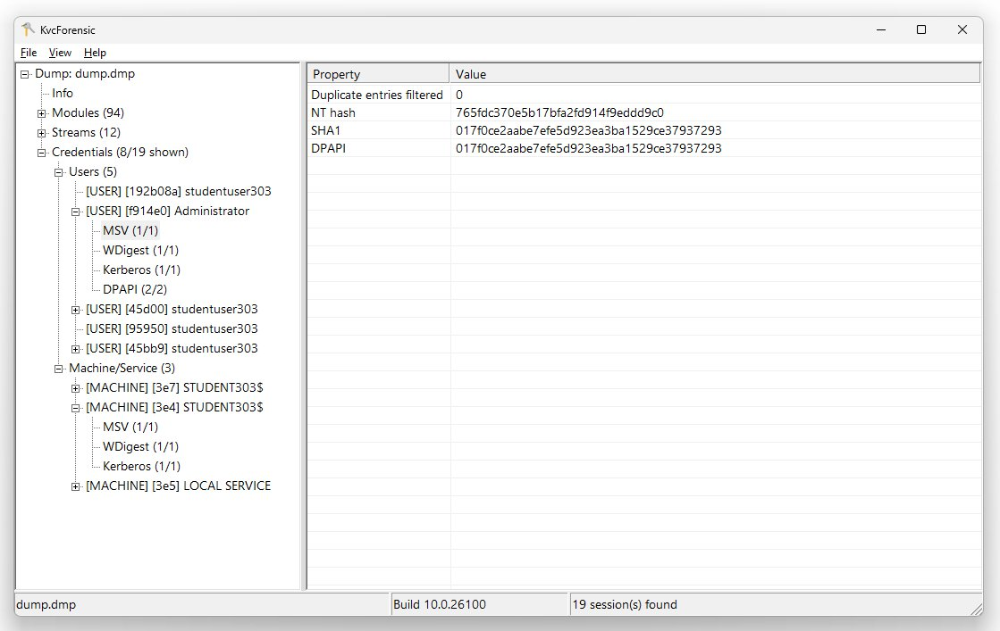

# KvcForensic



Windows LSA credential parser for `lsass.dmp` minidumps.
Active support targets: **Windows 11 24H2 / 25H2 / 26H1** (builds 26100+) and **Windows Server 2025**. A legacy decryption path is also implemented for **Windows 10 22H2** and related pre-24H2 builds; current in-repo validation covers **Windows 10 22H2 build 19045**.

Built entirely on pure Win32 API. No runtime dependencies beyond the OS and the BCrypt primitive. No DbgHelp, no third-party libraries, no framework.

Binary size is under 300 KB when linked against the system CRT, and under 600 KB with the CRT statically embedded.

---

## Requirements

`KvcForensic.json` must be placed in the same directory as `KvcForensic.exe`. It is loaded at startup before any analysis. The program will not run without it. If the file is missing, malformed, or fails schema validation, a startup error is shown and execution stops.

---

## What it does

Parses a full-memory `lsass.dmp` minidump and extracts credentials from the following security packages:

| Package    | Extracted data                                          |
|------------|---------------------------------------------------------|
| MSV1_0     | NT hash, LM hash, SHA1, DPAPI blob                     |
| WDigest    | Cleartext password (when available)                     |
| TSPKG      | RDP-related credentials from tspkg.dll                  |
| Kerberos   | Username, domain, cleartext password, ticket list       |
| CredMan    | Credential Manager stored entries                       |
| DPAPI      | MasterKey cache entries, decrypted masterkey, SHA1      |

Output formats: plain text report and/or structured JSON.

---

## In progress (high priority)

The following items are currently in progress and are treated as high-priority work:

1. **TSPKG (Terminal Services Package) coverage hardening**
   - Goal: reliable extraction from `tspkg.dll`, which may contain high-value cleartext RDP credentials.
   - Scope: stabilize `tspkg_x64` template coverage across Windows build variants and improve walker robustness for list/sentinel edge cases.
   - Status: preliminary implementation is present (`tspkg_x64` templates, `TspkgWalker`, and session integration), with ongoing tuning and validation.

2. **Kerberos ticket export (`.kirbi` / `.ccache`)**
   - Goal: make ticket extraction operationally useful by exporting parsed tickets directly to standard formats.
   - Scope: improve export completeness, compatibility, and handling of malformed/partial ticket data.
   - Status: implementation exists and is being hardened for consistent cross-dump behavior.

---

## Obtaining the dump

Standard tools (ProcDump, comsvcs.dll rundll32) fail against lsass.exe on modern Windows due to PPL (Protected Process Light) enforcement. To obtain a full-memory dump on Windows 11 24H2/25H2 with PPL active, use [kvc](https://github.com/wesmar/kvc), which bypasses PPL via kernel-level process protection manipulation:

```
kvc.exe dump lsass
```

The dump is written to the current user's Downloads folder by default. Pass it directly to KvcForensic:

```
KvcForensic.exe --analyze-dump --input "%USERPROFILE%\Downloads\lsass.dmp" --output result.txt --format both
```

---

## Architecture

### Memory model

The dump file is memory-mapped once via `CreateFileMappingW` / `MapViewOfFile` and exposed internally as a `std::span<const std::byte>`. Every subsequent read is a direct `memcpy` from a precomputed file offset. There is no `ReadFile`, no seeking, no intermediate heap allocation per read. `VirtualMemory::VaToRva()` translates virtual addresses from the dump's `Memory64ListStream` descriptors into file offsets by scanning the range table, which in practice resolves in a small number of comparisons per access.

```
lsass.dmp  ->  MapViewOfFile  ->  span<byte>
                                      |
                           VirtualMemory::VaToRva()
                                      |
                                memcpy to caller
```

### Minidump parsing

The minidump format is parsed from scratch using only the public MINIDUMP_* structure definitions from the Windows SDK. DbgHelp is not used at any point. Stream discovery, module enumeration, and Memory64ListStream range building are all implemented directly. The build number read from `SystemInfoStream` drives template selection for every subsequent parsing step.

### Cryptography

LSA encrypts in-memory credentials using either AES-CFB128 or 3DES-CBC, selected by a simple rule: if the encrypted blob length is not divisible by 8, AES is used; otherwise 3DES. This matches the logic observed in pypykatz.

The Windows BCrypt API exposes CFB only in 8-bit feedback (CFB8) mode. CFB128 is not available natively. KvcForensic implements CFB128 manually on top of `BCryptEncrypt` in ECB mode: the counter block is encrypted to produce a keystream block, which is XOR-ed with 16 bytes of ciphertext, then the counter is updated with those 16 ciphertext bytes before the next block. This matches the LSA behavior precisely.

3DES-CBC uses only the first 8 bytes of the IV.

Key material (AES-128/256, 3DES, IV) is located by scanning `lsasrv.dll` for the `LSA_24H2_plus` signature and following the `KIWI_BCRYPT_HANDLE_KEY` -> `KIWI_BCRYPT_KEY81` pointer chain to the raw key bytes at a fixed structure offset.

### Template system

All per-build configuration is stored in `KvcForensic.json`, which is loaded at startup from the executable's directory. The file must contain five mandatory top-level arrays: `msv_x64`, `wdigest_x64`, `kerberos_x64`, `dpapi_x64`, and `lsa_secrets_x64`. The `tspkg_x64` array is optional. If any mandatory array is absent or fails validation, initialization fails and the program stops.

The JSON is parsed by a custom single-pass recursive-descent parser with no floating-point support. No third-party JSON library is used. The size of the file is capped at 4 MB before parsing begins.

Each template entry defines:

- Build range (`min_build` / `max_build`)
- Byte signature to locate the data structure within the loaded DLL image in memory
- Offsets relative to the signature match
- `parser_support` flag (MSV only): whether full session field parsing is implemented for that build range

Templates are selected at runtime by matching the build number from `SystemInfoStream` against each entry's range. The MSV array covers entries spanning Windows 7 (build 7600) through Windows 11 25H2 (build 26200+). WDigest has 2 entries, Kerberos 1, DPAPI 1, LSA secrets 1, and TSPKG templates are optional.

For MSV, multiple overlapping template entries are allowed for the same build range. KvcForensic evaluates all matching candidates and selects the best-scoring layout against live dump memory. Even when `parser_support = true`, a heuristic shift/fallback path can be activated when template offsets do not validate well on the analyzed dump. In that case, the GUI shows a red warning status (`Heuristic mode` / `Heuristic fallback used`) to indicate reduced confidence.

LSA key material decryption is available for builds covered by the `lsa_secrets_x64` template. The primary fully-validated path is `26100+`, and the legacy path (`17763-26099`) is currently validated in-repo on Windows 10 22H2 build `19045`.

### MSV credential walk

```
FindMsvLogonList()        -- locate LogonSessionList via RIP-relative signature in lsasrv.dll
Walk()                    -- traverse doubly-linked list, one node per LogonSession
ExtractCredentials()      -- KIWI_MSV1_0_CREDENTIAL_LIST -> PRIMARY_CREDENTIAL_ENC
LsaSecretsExtractor       -- decrypt blob -> parse MSV1_0_PRIMARY_CREDENTIAL_11_H24_DEC
```

The decrypted `MSV1_0_PRIMARY_CREDENTIAL_11_H24_DEC` structure for 24H2/25H2 exists in two variants, distinguished by a format flag at offset 40. The flag reflects whether DPAPI protection is active for the credential:

**Format A** (isDPAPIProtected = 0):

| Offset | Field              | Size    |
|--------|--------------------|---------|
| +0     | LogonDomainName    | 16 B    |
| +16    | UserName           | 16 B    |
| +40    | isDPAPIProtected   | 1 B     |
| +41    | isNtOwfPassword    | 1 B     |
| +43    | isShaOwfPassword   | 1 B     |
| +44    | isDPAPILimitedKey  | 1 B     |
| +50    | DPAPILimitedKey    | 20 B    |
| +70    | NtOwfPassword      | 16 B    |
| +86    | LmOwfPassword      | 16 B    |
| +102   | ShaOwfPassword     | 20 B    |

**Format B** (isDPAPIProtected = 1, NT hash relocated):

| Offset | Field              | Size    |
|--------|--------------------|---------|
| +50    | NtOwfPassword      | 16 B    |
| +102   | ShaOwfPassword     | 20 B    |
| +122   | DPAPILimitedKey    | 20 B    |

Both formats are handled transparently during extraction.

### Kerberos AVL walk

Kerberos stores sessions in an `RTL_AVL_TABLE`. The tree is traversed with an iterative DFS using an explicit `std::vector` stack rather than recursion, eliminating any risk of stack overflow on deep or corrupted trees. Visited nodes are tracked in a `std::unordered_set<uint64_t>`. For each node, the `OrderedPointer` field at node+32 yields the session pointer. The LUID is read at session+64; if that value does not match any known session LUID, a fallback probe over offsets {56, 48, 72, 40, 32} is performed.

Kerberos ticket lists (three lists per session at offsets +280, +304, +328 in `KIWI_KERBEROS_LOGON_SESSION_24H2`) are extracted per session. Ticket metadata includes service name, target name, client name, flags, encryption type, kvno, and raw ticket bytes.

### WDigest list walk

On some builds, WDigest maintains multiple adjacent list heads. KvcForensic probes four consecutive sentinel candidates to ensure complete coverage, deduplicating entries by virtual address so nodes reachable from multiple lists are not counted twice.

### DPAPI master key walk

The DPAPI signature `48 89 4F 08 48 89 78 08` appears multiple times in `lsasrv.dll`. KvcForensic collects all occurrences in `lsasrv.dll`, `dpapisrv.dll`, and `lsass.exe` (with a full-memory fallback for ranges up to 64 MB if no module match is found), resolves each RIP-relative pointer to a `KIWI_MASTERKEY_CACHE_ENTRY` sentinel, and walks every distinct list. A global `visited_entries` set prevents double-processing of nodes reachable from multiple sentinels. Decrypted master keys are SHA1-hashed via BCrypt and included in the output.

### Credential Manager walk

CredMan entries are located via a pointer at a session-relative offset defined in the template (`session_credman_ptr_offset`, 0x168 on 24H2/25H2), which leads to a `KIWI_CREDMAN_SET_LIST_ENTRY` structure. The list is walked with a 255-entry safety limit. Usernames and server names are read from fixed offsets within each entry; passwords are decrypted using the same LSA key material as other packages.

---

## Design choices vs. mimikatz and pypykatz

After studying the source of both mimikatz and pypykatz, several design decisions were made differently:

**No DbgHelp dependency.** mimikatz relies on `MiniDumpReadDumpStream` and related DbgHelp APIs for minidump navigation. KvcForensic parses the MDMP format directly using only the public stream type definitions, eliminating the DbgHelp.dll dependency entirely.

**External JSON configuration.** All offsets and signatures are defined in `KvcForensic.json` rather than compiled into the binary. Adding coverage for a new Windows build requires editing the JSON file only, with no recompilation.

**CFB128 implemented manually.** BCrypt on Windows exposes CFB only in 8-bit feedback mode. Both mimikatz and pypykatz work around this via a manual CFB128 loop. KvcForensic uses the same approach -- ECB encrypt the counter, XOR with ciphertext, advance counter with ciphertext -- but implemented over BCrypt's ECB primitive rather than a software AES implementation, keeping all cryptographic operations within the OS-provided boundary.

**Multiple DPAPI sentinel collection.** mimikatz and pypykatz typically follow the first matching signature occurrence to locate the DPAPI master key list. KvcForensic collects all occurrences across all relevant modules and walks every distinct list, using a global visited set to deduplicate. This accounts for cases where multiple code locations reference different list roots.

**Iterative Kerberos AVL traversal.** Recursive tree walks are straightforward to implement but can overflow on corrupted or adversarially constructed dumps. KvcForensic uses an explicit stack-based DFS, which behaves correctly regardless of tree depth.

**Two-format MSV credential layout.** The 24H2/25H2 primary credential structure exists in two distinct field arrangements depending on whether DPAPI protection is active. KvcForensic detects the format from the flag byte at offset 40 and parses each variant accordingly. Neither mimikatz (at the time of writing, targeting the single known layout) nor pypykatz explicitly branch on this flag.

**Scoring-based layout detection and runtime fallback.** KvcForensic evaluates candidate session field layouts against actual dump content rather than relying solely on one static offset set. Candidates are scored by LUID plausibility, string readability, SID prefix validation, and credential-list pointer sanity. The highest-scoring layout is used, and when fallback is required the GUI marks the run as heuristic mode.

---

## CLI usage

```
KvcForensic.exe --analyze-dump [--input <file>] [--output <file>] [--format txt|json|both] [--compare <ref>] [--force] [--full] [--export-tickets <dir>]
KvcForensic.exe --cli "<command>"
KvcForensic.exe -cli "<command>"
KvcForensic.exe --help
```

**Options:**

`--input <file>` -- path to the dump file (default: `lsass.dmp` in the current directory)

`--output <file>` -- path for the text output (default: `output_KvcForensic.txt`). When `--format both` is used, the JSON output is written alongside with a `.json` extension derived from the text path.

`--format txt|json|both` -- output format (default: `txt`)

`--compare <ref>` -- compare extraction results against a previously generated text report. The diff is appended to the main output and also written to a `.compare.txt` file derived from the output path.

`--force` -- override the build number embedded in the dump with the build number of the machine running KvcForensic. Useful when the dump was taken under a mismatched build or when the SystemInfoStream is unreliable.

`--full` -- include full metadata in the text report: dump header, stream list, module list, and security package presence checks. Without this flag, output contains only the credential header and logon sessions.

`--export-tickets <dir>` -- export Kerberos tickets as `.kirbi` / `.ccache` files to the target directory. This feature is currently **in progress** and should be treated as **experimental**.

`--help` / `-h` / `/?` -- print usage and exit.

**Examples:**

```
# Analyze a dump, write both text and JSON output
KvcForensic.exe --analyze-dump --input lsass.dmp --format both

# Write a full report including metadata header
KvcForensic.exe --analyze-dump --input lsass.dmp --output result.txt --full

# Use both formats and compare against a previous run
KvcForensic.exe --analyze-dump --input dump.dmp --output result.txt --format both --compare previous.txt

# Override build detection with the current machine's build
KvcForensic.exe --analyze-dump --input dump.dmp --force

# Experimental: export Kerberos tickets to .kirbi/.ccache
KvcForensic.exe --analyze-dump --input dump.dmp --export-tickets .\tickets

# Run a command as TrustedInstaller
KvcForensic.exe --cli "cmd.exe /c whoami /all"
KvcForensic.exe -cli "powershell.exe -nop -ep bypass"
```

When invoked without arguments, the graphical interface opens.

---

## TrustedInstaller impersonation

The `-cli` mode executes an arbitrary command under the TrustedInstaller identity via a two-step token chain:

1. Acquire `SeDebugPrivilege` and `SeImpersonatePrivilege` for the current process.
2. Open `winlogon.exe`, duplicate its primary token, and impersonate SYSTEM.
3. Start (or attach to an already-running) `TrustedInstaller` service process.
4. Open the TrustedInstaller process, duplicate its token as a primary token, and enable the classical TrustedInstaller privilege set.
5. Launch the specified command via `CreateProcessWithTokenW` using the duplicated TrustedInstaller token.

This does not modify any kernel structures. It operates entirely in user mode and requires that the current process already holds SYSTEM-level access or equivalent.

---

## GUI

Single binary with a native WinAPI window. Supports Mica backdrop (Windows 11 22H2+) with automatic light/dark mode following the system theme. No WinUI 3, no Qt, no MFC.

The detail panel supports row selection with Ctrl+click and Shift+click. Selected rows can be copied to the clipboard with Ctrl+C or via the right-click context menu.

When the parser must use heuristic layout recovery (template mismatch or runtime fallback), the status bar turns red and displays a short warning. This indicates that extraction succeeded, but confidence is lower than an exact template match.

---

## Build requirements

- Windows 11 SDK (build 26100 or later recommended)
- MSVC or Clang-cl, C++20
- x64 only
- Link: `bcrypt.lib`, `advapi32.lib`, `shell32.lib`

---

## Supported builds

Full credential extraction (NT hash, plaintext passwords, DPAPI master keys) requires both a session template with `parser_support = true` and an LSA secrets key template. That path is fully validated on builds `26100+`; a legacy variant is also wired for `17763-26099`, with current validation anchored on Windows 10 22H2 build `19045`.

| Windows version         | Build range   | Credential extraction    |
|-------------------------|---------------|--------------------------|
| Windows 11 26H1         | 28000+        | Full                     |
| Windows 11 25H2         | 26200-27999   | Full                     |
| Windows 11 24H2         | 26100-26199   | Full                     |
| Windows Server 2025     | 26100+        | Full                     |
| Windows 10 22H2         | 19045         | Legacy core decrypt      |
| Windows 11 23H2 / 22H2 / 21H2, Windows 10 1809-22H2 | 17763-26099 | Legacy path, limited validation |
| Windows 10 1803 and earlier, 8.x, 7 | below 17763 | Template only / experimental |

Template entries for all builds from Windows 7 (7600) through Windows 11 21H2 are present in `KvcForensic.json` to allow signature location and session list traversal. Credential decryption is unavailable for these builds because the LSA key template does not cover them. Output for unsupported builds will contain session metadata (LUID, username, domain, SID) where the layout detection heuristic succeeds, but all credential fields will be empty.

Primary development and validation target is Windows 11 26H1 (build 28000), Windows 11 25H2 (build 26200), Windows 11 24H2 (build 26100), and the legacy Windows 10 22H2 checkpoint (build 19045).

---

## Output format

**Text (default, without `--full`):**

```
FILE: KvcForensic output
dump_path      lsass.dmp
dump_timestamp 2025-01-15 14:22:07
build_number   26200
os_version     10.0 (26200)

== LogonSession ==
authentication_id  123456 (1e240)
username           Administrator
domainname         WORKSTATION
sid                S-1-5-21-...

    == MSV ==
        NT:   aad3b435b51404eeaad3b435b51404ee
        LM:   aad3b435b51404eeaad3b435b51404ee
        SHA1: da39a3ee5e6b4b0d3255bfef95601890afd80709

    == WDIGEST [1] ==
        password  P@ssw0rd

    == Kerberos [1] ==
        username   Administrator
        domain     WORKSTATION
        password   P@ssw0rd

    == DPAPI [1] ==
        key_guid       8fa87aef-9636-454d-a8c6-4a7f2e3d1b0c
        masterkey      4a7f0e2c...
        sha1_masterkey 3b9e1f2a...
```

**Text (with `--full`):** prepends a metadata section listing the MDMP header fields, all streams with types and sizes, loaded modules with base addresses and sizes, and security package presence detection results.

**JSON:** structured equivalent of the text output, suitable for pipeline integration and programmatic processing.

---

## Project structure

```
KvcForensic.json    -- required configuration: all signatures and offsets for every build
core/               -- MemoryReader (mmap), VirtualMemory (VA->RVA), utilities
minidump/           -- MinidumpParser (no DbgHelp), stream/module/memory64 parsing
lsa/                -- LogonSessionWalker, MsvWalker, WdigestWalker, KerberosWalker, DpapiWalker
                       TspkgWalker, LsaReaderUtils, TemplateRegistry (JSON loader), LsaStructures
security/           -- LsaSecretsExtractor, MSV/WDigest/TSPKG/Kerberos/DPAPI/CredMan packages
analysis/           -- SafeAnalysisEngine, report builders (text + JSON)
KvcForensicMain     -- entry point, CLI parser, dual-head dispatch
KvcForensicWindow   -- WinAPI GUI, Mica integration
```

---

## Related projects

- [kvc](https://github.com/wesmar/kvc) -- DSE bypass and PP/PPL manipulation for lsass dumping on modern Windows with HVCI/VBS. Prerequisite for obtaining the dump on systems with PPL active.
- [KernelResearchKit](https://github.com/wesmar/KernelResearchKit) -- Windows 11 kernel research framework.

---

## Author

**Marek Wesolowski (wesmar)**
[kvc.pl](https://kvc.pl) · [GitHub](https://github.com/wesmar) · [LinkedIn](https://www.linkedin.com/in/ext4/)
